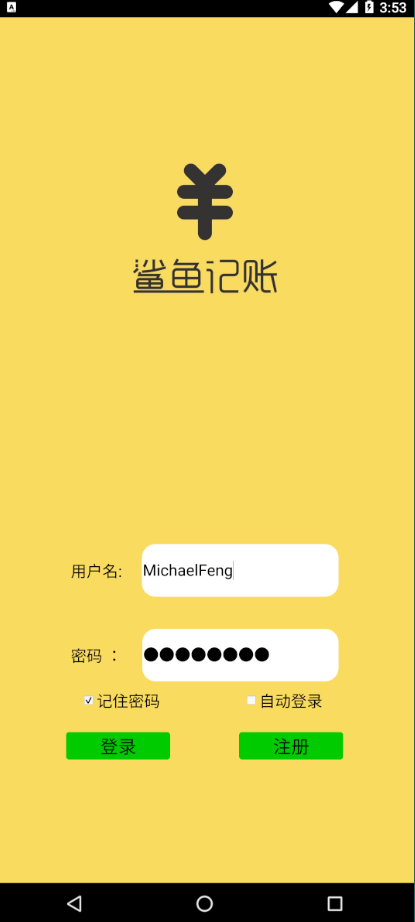
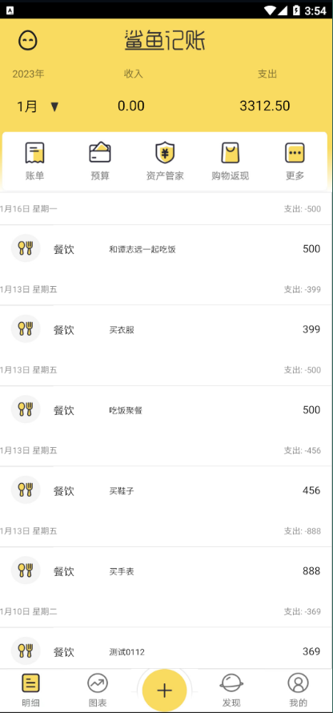
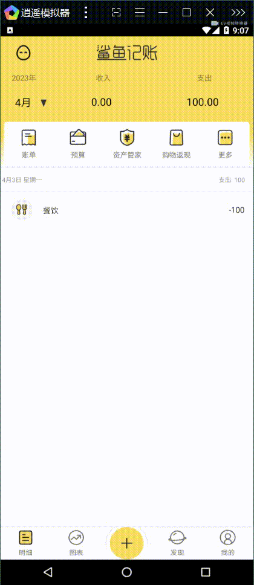
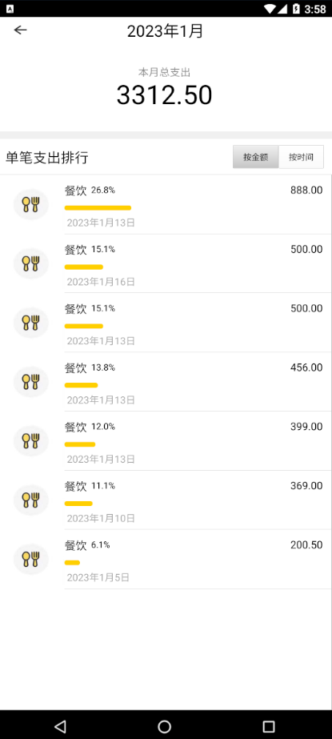
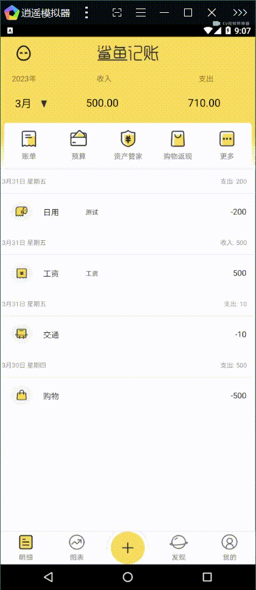
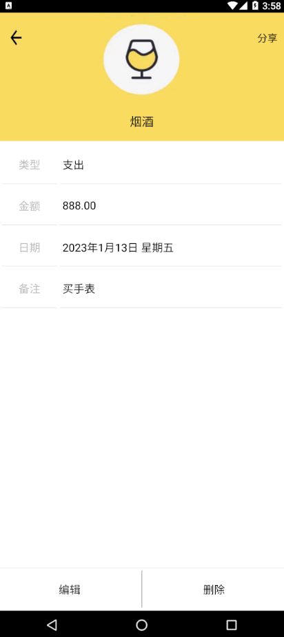
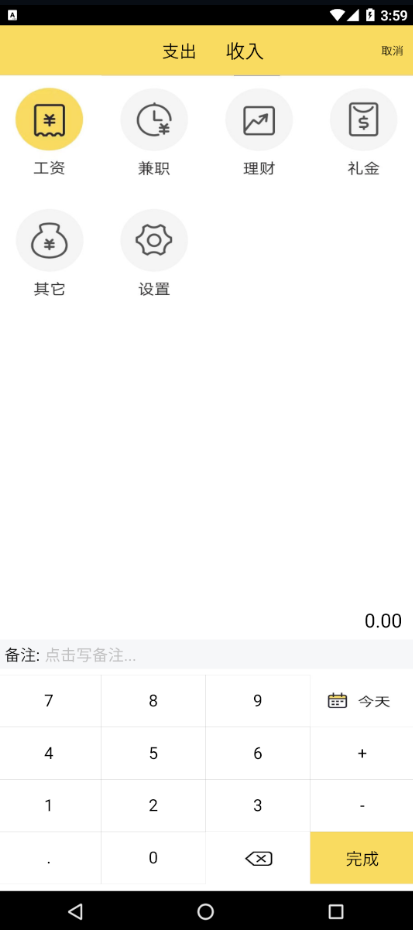

# SharkBookProject

## Qt C++ 安卓开发 高仿鲨鱼记账APP

#### 开发环境

- Qt5.14.2
- 构建套件：
    - Android for armeabi-v7a arm64-v8a x86 x86_64(clang Qt 5.14.2 for Android)
    - Jdk1.8.0_92
    - Android-SDK25.2.5
    - Andioid-NDK21.4
- 逍遥模拟器（开发调试使用）

#### 运行界面

1.登录界面 左侧为静态截图 右侧为功能GIF展示

2.自动登录GIF演示

3.登陆的注册功能GIF

4.登陆后的账单主界面

5.登录后界面主要框架模块GIF展示

6.根据不同日期查询账单数据GIF展示

7.账单子页面模块GIF展示

8.预算子页面模块GIF展示

9.资产管家子页面模块GIF展示

10.更多子页面模块GIF展示

11.记账子页面模块GIF展示

12.点击支出区域后的详情子界面

13.点击单条账目后的账目详情子界面,包含编辑账目和删除账目功能

14.一条账单信息的大致修改编辑流程GIF展示 

 

15.添加支出一条账目的流程GIF展示

16.添加收入账目的功能界面

17.发现页的额外加的通讯录功能界面----支持模糊查询(可根据人名以及拼音字母和电话号码搜索)

18.点击通讯录功能界面个人详情后的个人详情信息界面----------支持编辑、删除、和添加通讯录信息功能

19.我的子界面------目前只实现退出登录和修改密码功能

20.修改密码功能GIF展示

21.网上找的美丽小姐姐图片API接口应用GIF展示

22.万年历API查询应用GIF展示

---

后续将接着维护和完善并拓展相关功能,欢迎各位同仁的指正和建议

GitHub项目地址: https://github.com/MichaelFeng823/SharkBookProject

能否发动您点赞的小手给予我一个支持，一个star，我将不胜感激