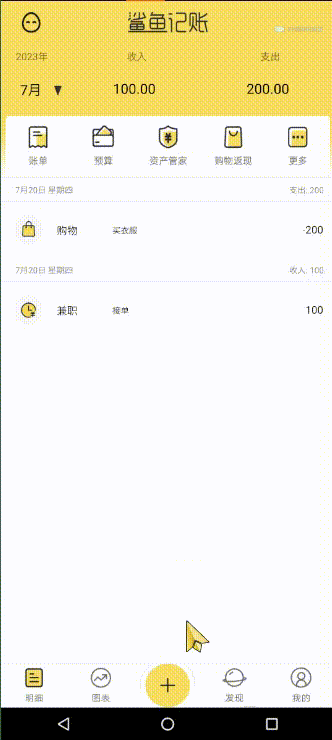
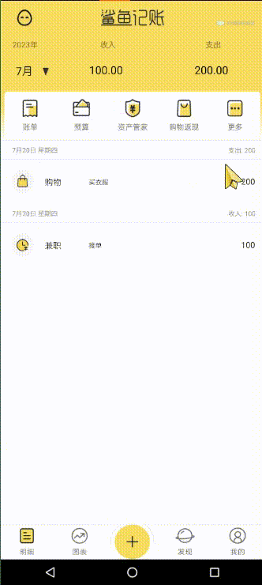

# SharkBookProject
本项目仅供学习交流使用，不用于商业目的，不承担任何法律责任。如果项目中包含了侵犯您权益的内容，请及时联系我们进行删除。
邮箱:3234210243@qq.com
## Qt C++ 安卓开发 高仿鲨鱼记账APP

#### 开发环境

- Qt5.14.2
- 构建套件：
    - Android for armeabi-v7a arm64-v8a x86 x86_64(clang Qt 5.14.2 for Android)
    - Jdk1.8.0_92
    - Android-SDK25.2.5
    - Andioid-NDK21.4
- 逍遥模拟器（开发调试使用）

#### 运行界面

1.登录界面GIF展示

2.自动登录GIF演示

3.登陆的注册功能GIF

4.根据不同日期查询账单数据GIF展示

5.账单子页面模块GIF展示

6.预算子页面模块GIF展示

7.资产管家子页面模块GIF展示

8.记账子页面模块GIF展示

9.点击单条账目后的账目详情子界面,包含编辑账目和删除账目功能

10.一条账单信息的大致修改编辑流程GIF展示 

 

11.图表界面如下所示高度还原原版

 

12.添加支出一条账目的流程GIF展示

13.发现页的额外加的通讯录功能界面----支持模糊查询(可根据人名以及拼音字母和电话号码搜索)

14.点击通讯录功能界面个人详情后的个人详情信息界面----------支持编辑、删除、和添加通讯录信息功能

15.添加一条联系人信息并分别通过姓名首字母、电话号码、QQ号码等匹配搜索

16.修改密码功能GIF展示

17.切换用户登录功能展示

.

18.网上找的美丽小姐姐图片API接口应用GIF展示

19.以及对图片缩放移动查看等基本操作

20.万年历API查询应用GIF展示

---

后续将接着维护和完善并拓展相关功能,欢迎各位同仁的指正和建议

GitHub项目地址: https://github.com/MichaelFeng823/SharkBookProject

能否发动您点赞的小手给予我一个支持，一个star，我将不胜感激
